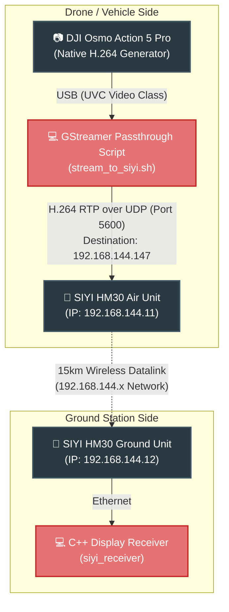

# DJI Osmo & SIYI HM30 Stream Tools

A comprehensive suite for streaming high-definition, low-latency H.264 video natively from a DJI Osmo Action camera over a SIYI HM30 datalink system.

---

## 🎯 Architecture Diagram

This system achieves ultra-low latency by enabling a **zero-copy data path**. Instead of receiving raw video from the DJI Osmo and burning CPU cycles to re-encode it, the system extracts the native H.264 byte-stream generated internally by the DJI Osmo hardware encoder, wraps it in RTP packets, and injects it straight into the SIYI HM30 network.



---

## 🛠️ Repository Components

### 1. `scripts/stream_to_siyi.sh` (The Core Pipeline)
A GStreamer script tailored for UVC cameras with hardware H.264 compliance (like the DJI Osmo).
* **Zero-latency focus**: Relies entirely on `h264parse` and `rtph264pay` rather than any software encoder (`x264enc`).
* **Configurable**: Easily toggle between `720p` and `1080p`, or change destination IPs without touching C++ code.

### 2. `src/streamer/main.cpp` (The Debugger)
A standalone `C++` & `FFmpeg (libav)` utility that generates SMPTE colour bars. 
* **Use Case**: If your drone is on the bench and the Osmo battery is dead, but you need to verify that video data successfully traverses the wireless link.
* **Mechanism**: Generates raw YUV frames -> software encodes via `libx264` (`ultrafast`/`zerolatency`) -> muxes to RTP.

### 3. `src/receiver/main.cpp` (The Viewer)
A custom C++ / SDL2 software decoder.
* **Use Case**: Connecting to the ground unit to display the live feed. It bypasses heavy Ground Control Station (GCS) software.
* **Mechanism**: Listens for raw RTP (or RTSP) traffic -> `libavcodec` Hardware/Software Decode -> native `SDL2 YUV` planar texture rendering.

---

## 🚀 Usage Guide

### Important Note on Paths
Since the refactoring to a production standard, the bash script lives inside the `scripts/` directory, and the compiled C++ apps reside in `build/`. Make sure you run commands from the repository root appropriately.

### 1. Send DJI Video to Air Unit (Zero-Copy)
Plug the DJI Osmo via USB to the companion computer. By default, this will stream 720p @ 30FPS to IP `192.168.144.147` on port `5600`.
```bash
./scripts/stream_to_siyi.sh
```

**Override Settings:**
To push a 1080p stream to a specific device:
```bash
./scripts/stream_to_siyi.sh 192.168.144.147 5600 1080p
```

### 2. Receive the Feed on the Ground Station 
On the ground laptop connected to the SIYI HM30 Ground Unit:
```bash
cd build

# Option A: Connect directly to the SIYI RTSP server (if configured)
./siyi_receiver --rtsp rtsp://192.168.144.12:8554/stream

# Option B: Listen directly for raw UDP RTP packets on port 5600
./siyi_receiver --udp 5600
```

### 3. Generate a Test Pattern
If you need to verify network routing independent of the webcam:
```bash
./build/siyi_streamer --ip 192.168.144.147 --port 5600
```

---

## 📦 Building from Source

### Dependencies
Ensure you have the toolchains and multimedia libraries installed:
```bash
sudo apt update
sudo apt install build-essential cmake pkg-config \
    libavcodec-dev libavformat-dev libavutil-dev libswscale-dev \
    libsdl2-dev gstreamer1.0-tools gstreamer1.0-plugins-good gstreamer1.0-plugins-base
```

### Compilation
```bash
mkdir build && cd build
cmake ..
make -j$(nproc)
```

### Developer Notes
* **RAII Memory Safety**: C++ components use modern `std::unique_ptr` wrappers integrated in `src/common/ffmpeg_ptr.hpp`. No manual `av_frame_free()` or leak worries when streams interrupt or reconnect dynamically.
* **SDP Files**: The receiver dynamically creates an SDP payload descriptor file in `/tmp/siyi_receiver.sdp` to assist FFmpeg in resolving the connectionless UDP format.
